# 🚢 XT Shipping Management System
## Governance & Compliance Demo

---

## 🎯 Maritime Domain Issues

### 1. Crew Working Hours Violations

**The Problem:**
Crew members working excessive hours beyond international maritime law limits, creating safety risks and legal violations.

**Maritime Context:**
The Maritime Labour Convention (MLC) strictly limits crew working hours to prevent fatigue-related accidents. Violations can result in vessel detention at ports and significant fines.

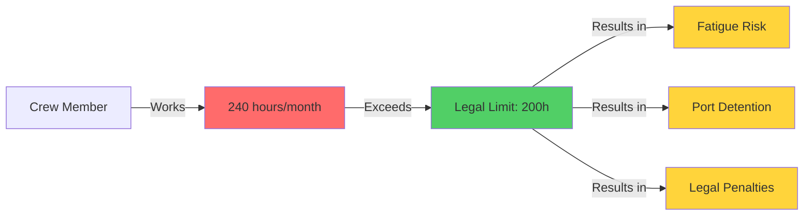

**The Fix:**
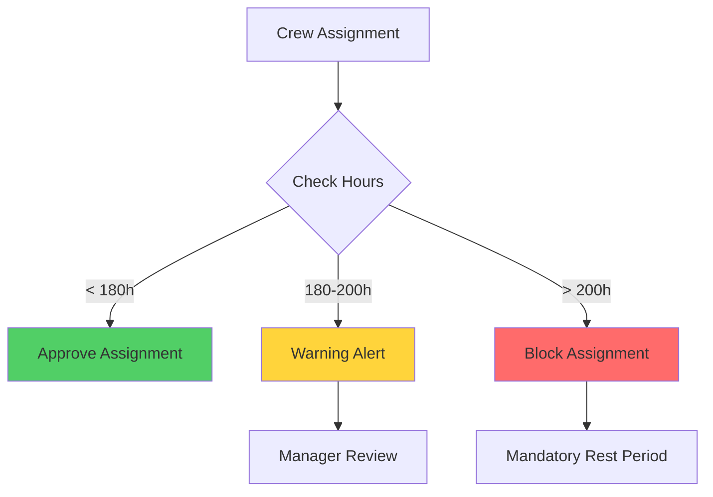

---

### 2. Expired Maritime Certifications

**The Problem:**
Vessels and crew operating with expired safety certificates, insurance, or qualifications.

**Maritime Context:**
International maritime regulations (SOLAS, MARPOL) require valid certifications for all vessels and crew. Operating without valid certificates voids insurance and can result in vessel detention.

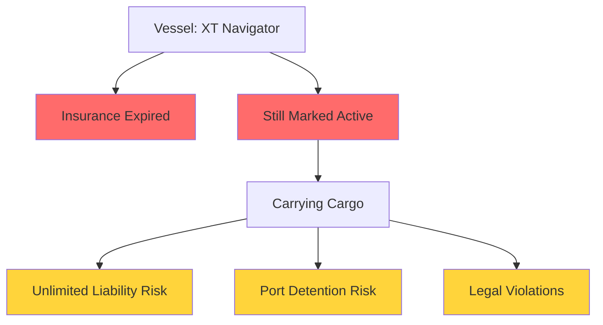

**The Fix:**
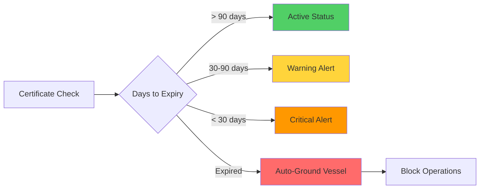

---

### 3. Cargo Compliance Violations

**The Problem:**
Hazardous cargo loaded without proper documentation or safety approvals.

**Maritime Context:**
International Maritime Dangerous Goods (IMDG) Code requires strict documentation and approval for hazardous materials. Violations can cause environmental disasters and criminal liability.

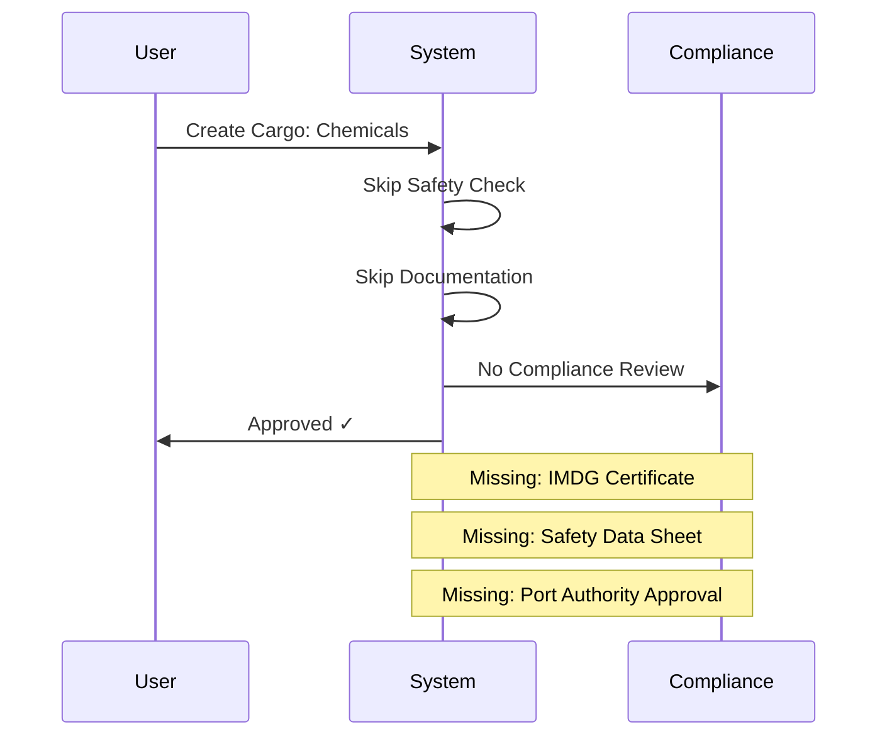

**The Fix:**
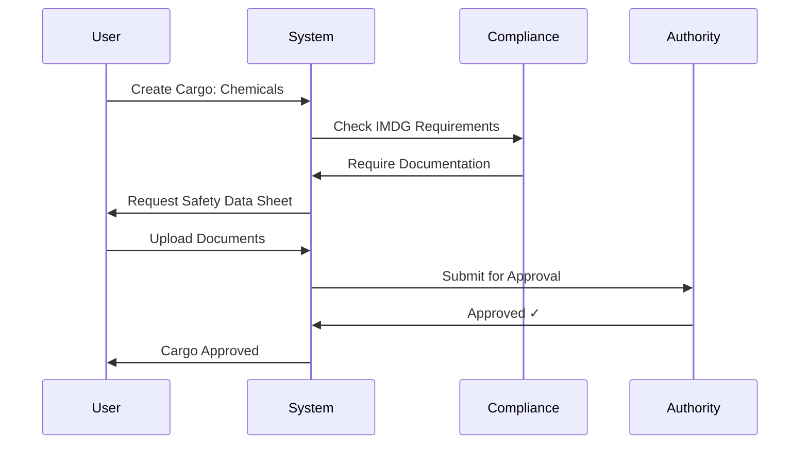

---

### 4. Missing Data Retention Policies

**The Problem:**
No automated data retention or archival policies for maritime records.

**Maritime Context:**
Maritime regulations require retention of voyage records, crew logs, and cargo manifests for 5-10 years for legal and insurance purposes.

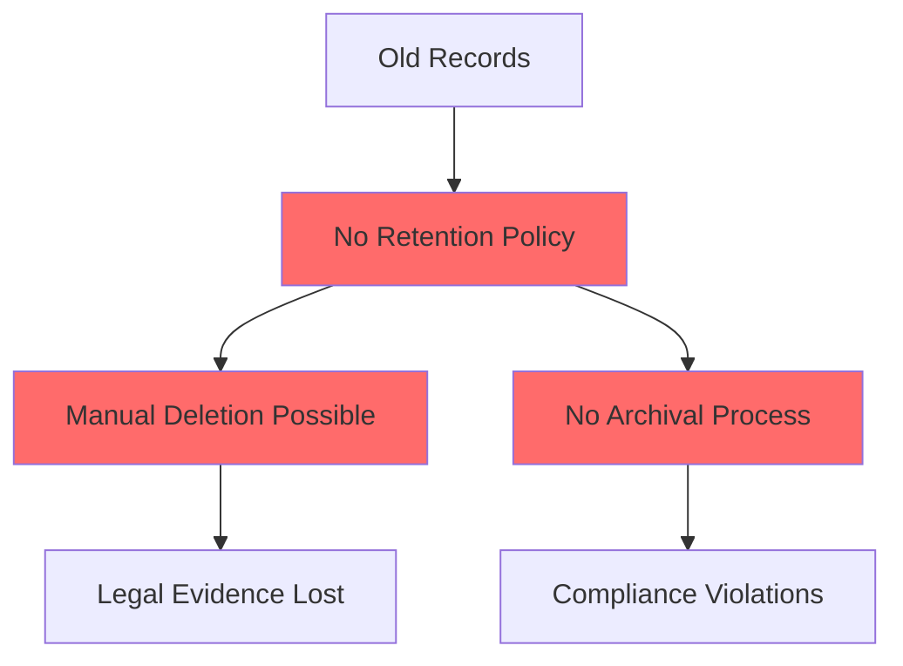

**The Fix:**
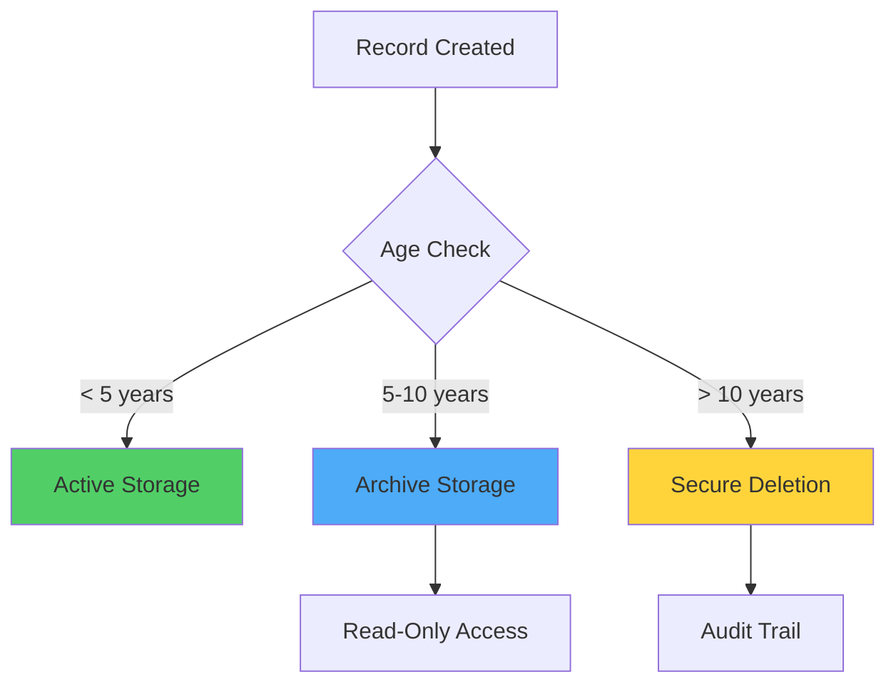

---

## 🔐 Governance & Control Issues

### 5. Segregation of Duties Violation

**The Problem:**
Same person can create and approve their own financial transactions, enabling fraud.

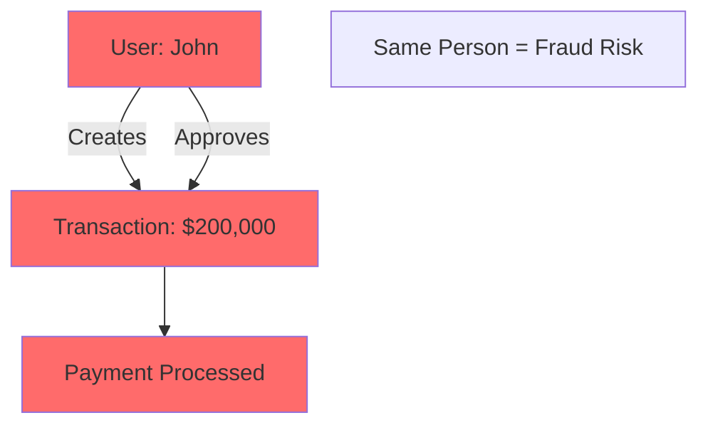

**The Fix:**
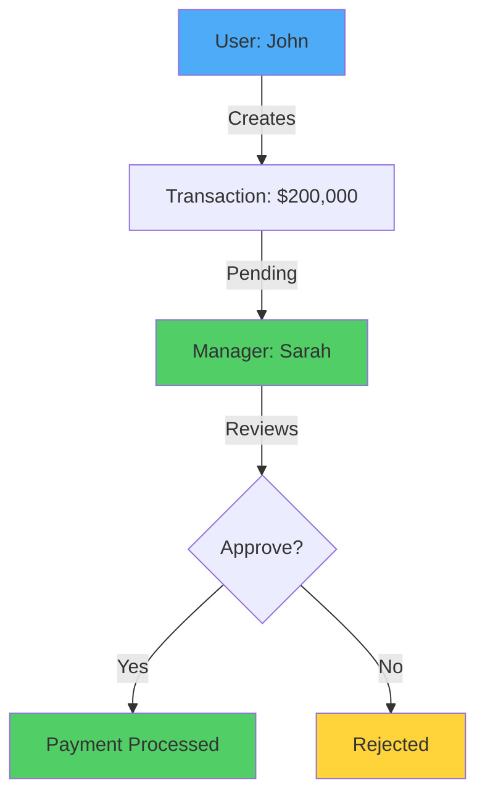

---

### 6. Deletable Audit Logs

**The Problem:**
Users can delete their own audit trail, destroying evidence of actions.

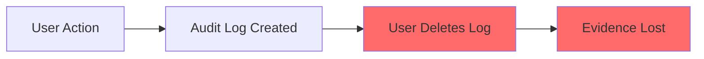

**The Fix:**
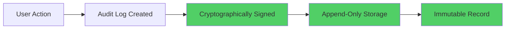

---

### 7. Missing Role-Based Access Control

**The Problem:**
All users can access all data regardless of their role or need.

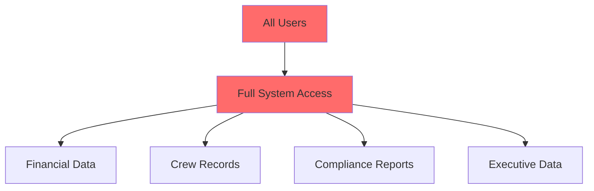

**The Fix:**
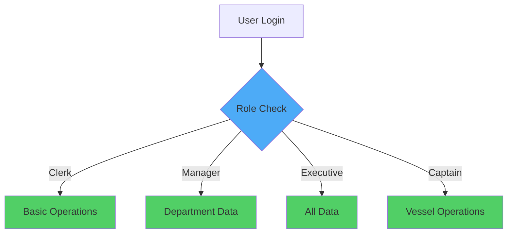

---

### 8. No Approval Workflows

**The Problem:**
Critical operations execute immediately without review or approval process.

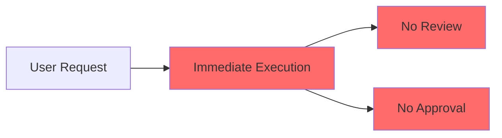

**The Fix:**
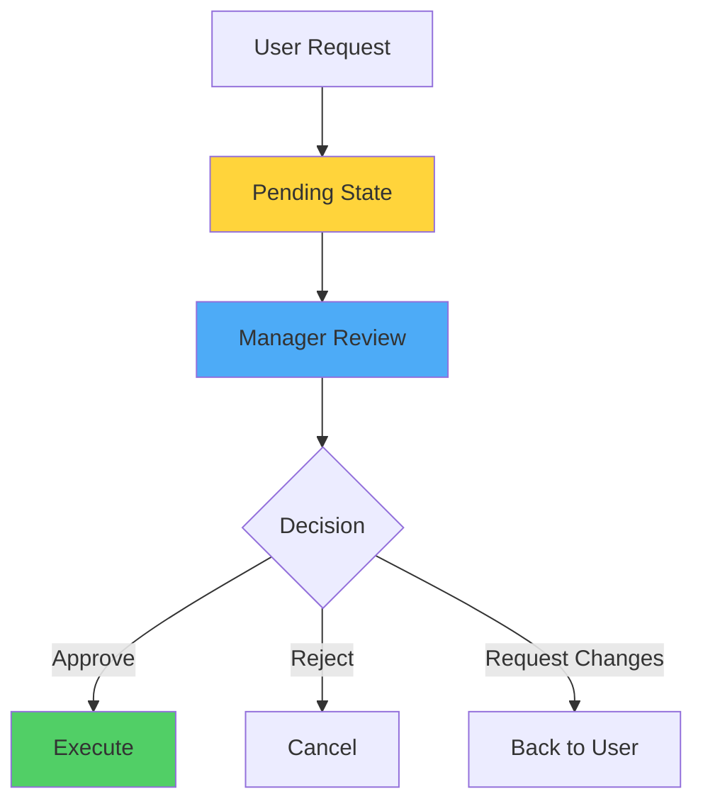

---

### 9. Missing Compliance Monitoring

**The Problem:**
No automated system to monitor and enforce compliance with maritime regulations.

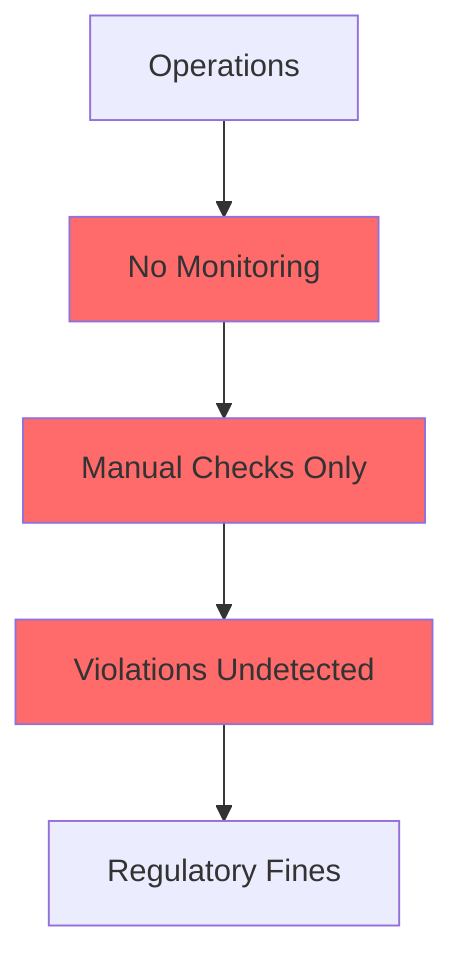

**The Fix:**
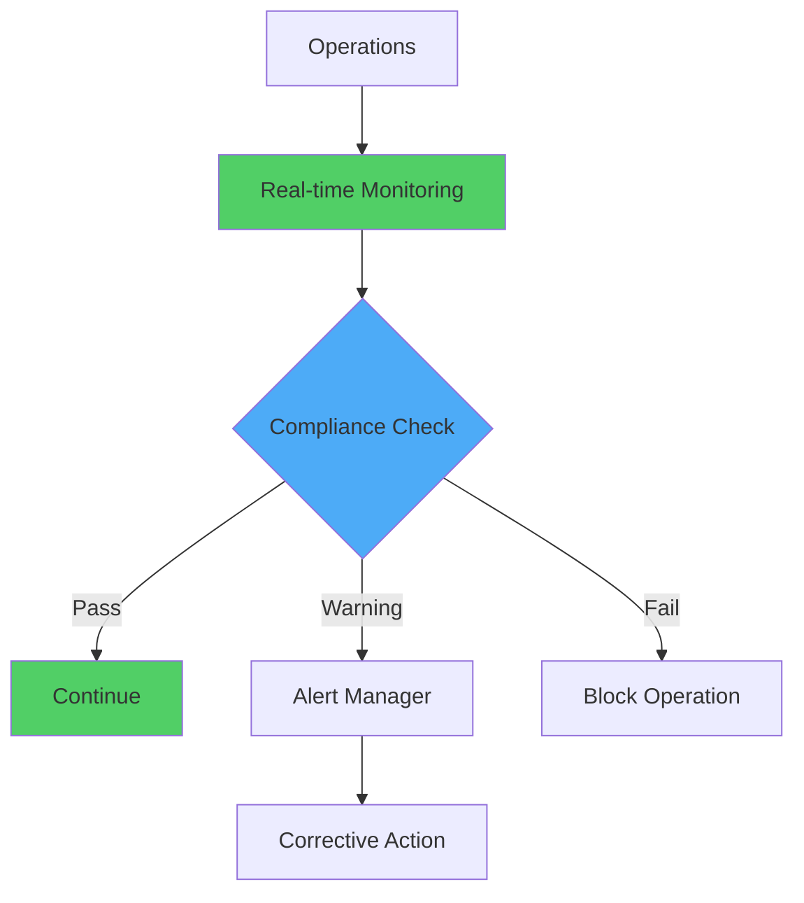

---

## 🔒 Security Vulnerabilities

### 10. SQL Injection

**The Problem:**
User input directly concatenated into SQL queries, allowing database manipulation.

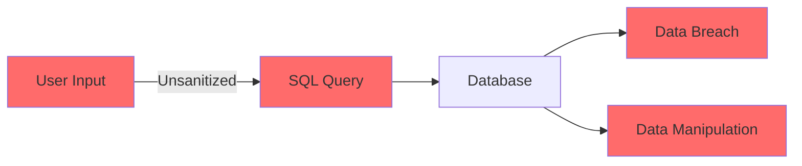

**Example Attack:**
```
Username: admin' OR '1'='1
Password: anything
Result: Bypass authentication
```

**The Fix:**
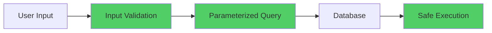

---

### 11. Hardcoded Credentials

**The Problem:**
Default admin credentials hardcoded in the database and visible in login page.

```mermaid
graph TD
    A[Source Code] --> B[Hardcoded Passwords]
    B --> C[admin/admin123]
    B --> D[captain/captain123]
    B --> E[finance/finance123]
    C --> F[Easy to Guess]
    D --> F
    E --> F
    F --> G[Unauthorized Access]
    
    style B fill:#ff6b6b
    style F fill:#ff6b6b
    style G fill:#ff6b6b
```

**The Fix:**
```mermaid
graph TD
    A[User Registration] --> B[Strong Password Policy]
    B --> C[Password Hashing]
    C --> D[Secure Storage]
    D --> E[Multi-Factor Auth]
    
    style B fill:#51cf66
    style C fill:#51cf66
    style D fill:#51cf66
    style E fill:#51cf66
```

---

### 12. Plaintext Password Storage

**The Problem:**
Passwords stored in database without encryption or hashing.

```mermaid
graph LR
    A[User Password] -->|No Encryption| B[Database]
    B --> C[Plaintext Storage]
    C --> D[Database Breach]
    D --> E[All Passwords Exposed]
    
    style A fill:#ff6b6b
    style C fill:#ff6b6b
    style E fill:#ff6b6b
```

**The Fix:**
```mermaid
graph LR
    A[User Password] --> B[Salt Generation]
    B --> C[Bcrypt Hashing]
    C --> D[Hashed Storage]
    D --> E[Secure Verification]
    
    style B fill:#51cf66
    style C fill:#51cf66
    style D fill:#51cf66
    style E fill:#51cf66
```

---

### 13. Insecure Session Management

**The Problem:**
Session data stored in client-side cookies without encryption or validation.

```mermaid
graph TD
    A[User Login] --> B[Session Cookie]
    B --> C[No Encryption]
    B --> D[No Expiration]
    B --> E[No Validation]
    C --> F[Session Hijacking]
    D --> F
    E --> F
    
    style C fill:#ff6b6b
    style D fill:#ff6b6b
    style E fill:#ff6b6b
    style F fill:#ff6b6b
```

**The Fix:**
```mermaid
graph TD
    A[User Login] --> B[Secure Session]
    B --> C[Server-side Storage]
    B --> D[Encrypted Token]
    B --> E[Auto Expiration]
    B --> F[IP Validation]
    
    style C fill:#51cf66
    style D fill:#51cf66
    style E fill:#51cf66
    style F fill:#51cf66
```

---

## 🔧 Solution Roadmap

```mermaid
gantt
    title Implementation Timeline
    dateFormat  YYYY-MM-DD
    section Critical Fixes
    Segregation of Duties           :crit, 2026-06-07, 7d
    Immutable Audit Logs           :crit, 2026-06-07, 7d
    SQL Injection Prevention       :crit, 2026-06-07, 5d
    Password Security              :crit, 2026-06-12, 5d
    
    section High Priority
    Certificate Expiry Automation  :2026-06-14, 7d
    Working Hours Enforcement      :2026-06-14, 7d
    Role-Based Access Control      :2026-06-21, 10d
    Cargo Compliance Automation    :2026-06-21, 10d
    
    section Medium Priority
    Approval Workflows            :2026-07-01, 7d
    Data Retention Policies       :2026-07-08, 14d
    Compliance Monitoring         :2026-07-08, 14d
    Session Security              :2026-07-15, 7d
```

---

## 📊 Impact Analysis

```mermaid
graph TD
    A[Current State] --> B[High Risk]
    B --> C[Fraud Exposure]
    B --> D[Legal Violations]
    B --> E[Safety Risks]
    B --> F[Security Breaches]
    
    G[After Fixes] --> H[Controlled Environment]
    H --> I[Fraud Prevention]
    H --> J[Regulatory Compliance]
    H --> K[Enhanced Safety]
    H --> L[Secure Operations]
    
    style A fill:#ff6b6b
    style B fill:#ff6b6b
    style G fill:#51cf66
    style H fill:#51cf66
```

---

## 🎬 Live Demo Walkthrough

### Step 1: Login & Security Issues
- Demonstrate SQL injection vulnerability
- Show hardcoded credentials on login page
- Display plaintext passwords in database

### Step 2: Access Control Problems
- Login as clerk and access executive financial data
- Show unrestricted access across all roles
- Demonstrate missing RBAC

### Step 3: Maritime Compliance Violations
- Display crew member with 240 working hours (exceeds 200h limit)
- Show expired maritime certificates still marked as "Active"
- View vessel with expired insurance carrying cargo

### Step 4: Governance Failures
- Create a $200,000 transaction
- Approve it with the same user account
- Highlight the segregation of duties violation

### Step 5: Audit Trail Manipulation
- View audit logs of previous actions
- Delete an audit log entry
- Show how evidence can be destroyed

### Step 6: Cargo & Compliance
- Create hazardous cargo without safety documentation
- Show missing IMDG compliance checks
- Demonstrate lack of approval workflows

### Step 7: Compliance Dashboard
- Review comprehensive list of all violations
- Show real-time compliance status
- Demonstrate the scope of governance gaps

---

## 💡 Business Value

### Risk Mitigation
- Prevents fraud through proper controls
- Eliminates unlimited liability exposure
- Ensures maritime safety compliance
- Protects against cyber attacks

### Operational Excellence
- Automated compliance monitoring
- Reduced manual oversight requirements
- Proactive risk management
- Streamlined approval processes

### Regulatory Compliance
- Meets international maritime standards (IMO, SOLAS, MLC)
- Satisfies financial regulations (SOX)
- Maintains audit trail integrity
- Ensures data protection (GDPR)

---

**XT Group** | *Service • Safety • Efficiency*